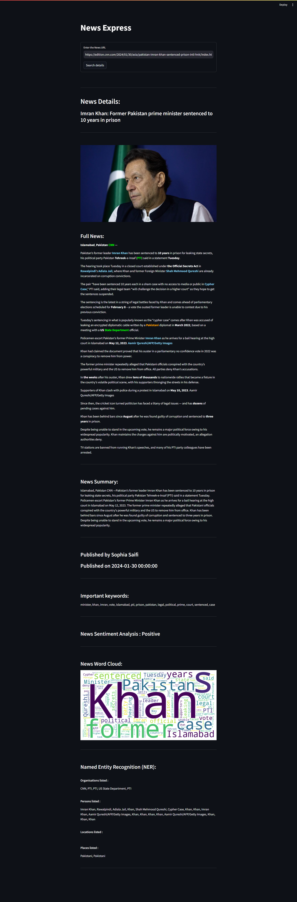

# News Summarizer

"**News Express**" is a **Streamlit**-based application designed to enhance the analysis of news articles. The user-friendly interface prompts users to input a news article URL, initiating a comprehensive analysis. Leveraging **spaCy's Named Entity Recognition**, the application categorizes and color-codes entities such as persons, organizations, and locations, providing a visual representation of the key elements in the news content.

The application offers a detailed view of the article, showcasing the full news content with named entities highlighted for easy identification. This feature enhances the readability of the news and allows users to grasp the crucial information efficiently. Additionally, a summarized version of the article is provided, offering a quick overview of the news content.

Publishing details, including the author's name and publication date, are prominently displayed, enriching the user's understanding of the news source. "**News Express**" goes beyond traditional news analysis by incorporating **sentiment analysis**, allowing users to discern whether the overall sentiment of the article is positive, negative, or neutral. This multifaceted approach provides users with a holistic understanding of news articles, making "**News Express**" a valuable tool for staying informed and gaining insights from diverse news sources.

-----

## Installation

```
pip install streamlit
```
```
pip install matplotlib
```
```
pip install plotly
```
```
pip install spacy
```
```
pip install textblob
```
```
pip install newspaper3k
```
```
pip install wordcloud
```

Firstly import the `streamlit`, `matplotlib`, `plotly`, `spacy`, `textblob`, `newspaper3k` and `wordcloud` libraries through the terminal that will help in the program.

-----

## How to run:

Download the zip file and extract the files. Then open your terminal or command prompt, navigate to the directory where the `main.py` python file is saved, and run the following command:

```
streamlit run main.py
```

-----

## Aim of the Project:

1. **Enhanced News Exploration:** "News Express" offers an enriched news exploration experience by leveraging advanced natural language processing techniques.

2. **Visual Enrichment:** The project employs spaCy's Named Entity Recognition to visually enhance news articles, highlighting key entities such as persons, organizations, and locations.

3. **Comprehensive Analysis Tools:** Users can benefit from various analysis tools, including sentiment analysis, summarization, and word cloud generation, facilitating efficient extraction of meaningful insights from news content.

## Advantages:


1. **Rich News Insights:** "News Express" provides users with rich insights into news articles, including named entity recognition, sentiment analysis, and keyword extraction, enhancing comprehension.

2. **User-Friendly Interface:** The streamlined and user-friendly interface of the application makes it accessible for users to input news URLs, facilitating quick and easy exploration of relevant information.

3. **Visual Representations:** The inclusion of visual elements such as word clouds and entity-highlighted text enhances the overall user experience and aids in quickly identifying important information in news articles.

-----

## Disadvantages and Limitations:

1. **Dependency on Article Structure:** The effectiveness of the tool is contingent on the structure and content presentation of the news article. Variations in structure may impact the accuracy of named entity recognition and other analysis features.

2. **Limited Source Compatibility:** The tool relies on the "newspaper" library for article extraction, which may not be compatible with all news sources. Some websites or articles may not be supported, limiting the scope of the tool.

3. **Potential Accuracy Challenges:** While the sentiment analysis and named entity recognition provide valuable insights, their accuracy is subject to the inherent challenges of natural language processing, and occasional inaccuracies may occur.

-----

## Future Improvements:

1. **Multi-Language Support:** Enhance the tool's capabilities by incorporating support for multiple languages, enabling users to analyze news articles in languages beyond English.

2. **Customizable NLP Models:** Allow users to choose from a selection of natural language processing models, providing flexibility and accommodating diverse preferences for named entity recognition and sentiment analysis.

3. **Expanded News Source Compatibility:** Work towards expanding compatibility with various news sources and website structures, ensuring broader coverage and access to a more extensive range of news articles.

4. **Real-Time Updates:** Implement a feature for real-time news analysis, allowing users to input live news URLs or receive updates on breaking news, keeping the information current and relevant.

5. **User-Generated Content Analysis:** Extend the tool's functionality to analyze user-generated content, such as comments and forum posts related to news articles, providing a more comprehensive understanding of public sentiment and reactions.

-----

## Technologies Learned:

1. **Streamlit:** Used for creating the web-based user interface, enabling easy interaction and visualization of news details.

2. **NLTK and SpaCy:** Leveraged for natural language processing tasks, such as named entity recognition, entity categorization, and part-of-speech tagging.

3. **TextBlob:** Employed for sentiment analysis, extracting sentiments like positivity, negativity, and neutrality from the news articles.

4. **Matplotlib and WordCloud:** Utilized for generating visualizations, including word clouds and sentiment analysis charts, enhancing the graphical representation of information.

5. **Newspaper3k:** Integrated for web scraping and article parsing, facilitating the extraction of relevant information from news articles.

6. **WordCloud:** Used for generating visual representations of the most important keywords, enhancing the understanding of critical terms in the news.

-----

## Outputs:

